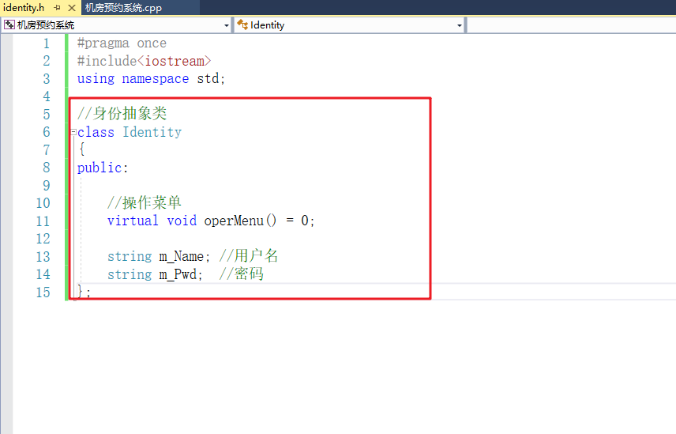
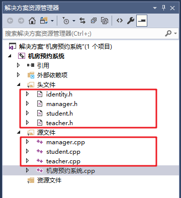

# 设计类

## 1 身份的基类

* 在整个系统中，有三种身份，分别为：学生代表、老师以及管理员
* 三种身份有其共性也有其特性，因此我们可以将三种身份抽象出一个身份基类**identity**
* 在头文件下创建Identity.h文件


Identity.h中添加如下代码：

```C++
#pragma once
#include <iostream>
using namespace std;

//身份抽象类
class Identity
{
public:

	//操作菜单
	virtual void operMenu() = 0;

	string m_Name; //用户名
	string m_Pwd;  //密码
};
```

效果如图：




## 2 学生类

### 2.1 功能分析

* 学生类主要功能是可以通过类中成员函数，实现预约实验室操作

* 学生类中主要功能有：

  * 显示学生操作的菜单界面
  * 申请预约
  * 查看自身预约
  * 查看所有预约
  * 取消预约

  ​

#### 5.2.2 类的创建

* 在头文件以及源文件下创建 student.h 和 student.cpp文件


student.h中添加如下代码：

```C++
#pragma once
#include <iostream>
using namespace std;
#include "identity.h"

//学生类
class Student :public Identity
{
public:
	//默认构造
	Student();

	//有参构造(学号、姓名、密码)
	Student(int id, string name, string pwd);

	//菜单界面
	virtual void operMenu(); 

	//申请预约
	void applyOrder(); 

	//查看我的预约
	void showMyOrder(); 

	//查看所有预约
	void showAllOrder(); 

	//取消预约
	void cancelOrder();
	
	//学生学号
	int m_Id;

};
```


student.cpp中添加如下代码：

```C++
#include "student.h"

//默认构造
Student::Student()
{
}

//有参构造(学号、姓名、密码)
Student::Student(int id, string name, string pwd)
{
}

//菜单界面
void Student::operMenu()
{
}

//申请预约
void Student::applyOrder()
{

}

//查看我的预约
void Student::showMyOrder()
{

}

//查看所有预约
void Student::showAllOrder()
{

}

//取消预约
void Student::cancelOrder()
{

}

```


## 3 老师类

### 3.1 功能分析

- 教师类主要功能是查看学生的预约，并进行审核

- 教师类中主要功能有：

  - 显示教师操作的菜单界面

  - 查看所有预约

  - 审核预约

    ​

### 3.2 类的创建

- 在头文件以及源文件下创建 teacher.h 和 teacher.cpp文件

teacher.h中添加如下代码：

```C++
#pragma once
#define _CRT_SECURE_NO_WARNINGS
#include<iostream>
using namespace std;
#include "identity.h"

class Teacher :public Identity
{
public:

	//默认构造
	Teacher();

	//有参构造 (职工编号，姓名，密码)
	Teacher(int empId, string name, string pwd);

	//菜单界面
	virtual void operMenu();

	//查看所有预约
	void showAllOrder(); 

	//审核预约
	void validOrder(); 

	int m_EmpId; //教师编号

};
```


* teacher.cpp中添加如下代码:

```C++
#include"teacher.h"

//默认构造
Teacher::Teacher()
{
}

//有参构造 (职工编号，姓名，密码)
Teacher::Teacher(int empId, string name, string pwd)
{
}

//菜单界面
void Teacher::operMenu()
{
}

//查看所有预约
void Teacher::showAllOrder()
{
}

//审核预约
void Teacher::validOrder()
{
}
```

## 4 管理员类

### 4.1 功能分析

- 管理员类主要功能是对学生和老师账户进行管理，查看机房信息以及清空预约记录

- 管理员类中主要功能有：

  - 显示管理员操作的菜单界面

  - 添加账号

  - 查看账号

  - 查看机房信息

  - 清空预约记录

    ​

### 4.2 类的创建

- 在头文件以及源文件下创建 manager.h 和 manager.cpp文件

manager.h中添加如下代码：

```C++
#pragma once
#include<iostream>
using namespace std;
#include "identity.h"

class Manager :public Identity
{
public:

	//默认构造
	Manager();

	//有参构造  管理员姓名，密码
	Manager(string name, string pwd);

	//选择菜单
	virtual void operMenu();

	//添加账号  
	void addPerson();

	//查看账号
	void showPerson();

	//查看机房信息
	void showComputer();

	//清空预约记录
	void cleanFile();

};
```


* manager.cpp中添加如下代码:

```C++
#include "manager.h"

//默认构造
Manager::Manager()
{
}

//有参构造
Manager::Manager(string name, string pwd)
{
}

//选择菜单
void Manager::operMenu()
{
}

//添加账号  
void Manager::addPerson()
{
}

//查看账号
void Manager::showPerson()
{
}

//查看机房信息
void Manager::showComputer()
{
}

//清空预约记录
void Manager::cleanFile()
{
}
```

至此，所有身份类创建完毕，效果如图：




---
Go to | [Home](./README.md) | [Head](#设计类) | [程序框架<-Prev](./D1_MainFrame.md) |[Next->登录模块](./D3_Login.md)| 